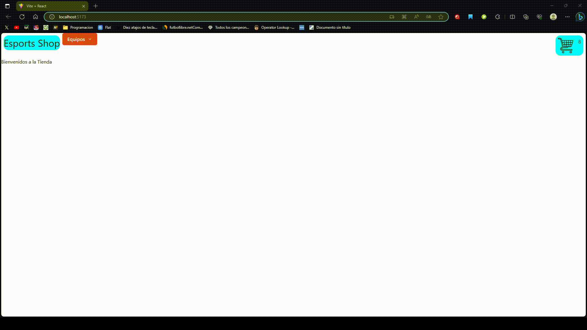

# Proyecto de React
## Profe: Omar Manias
### Comision: 47120
### Alumno: Leonardo Pereyra

# Tienda de Camisetas de Esports

Un proyecto de tienda en línea que ofrece camisetas de equipos de esports.

## Descripción

Este proyecto es una tienda en línea que se centra en la venta de camisetas de equipos de esports. Los aficionados y seguidores de los deportes electrónicos pueden explorar y comprar una variedad de camisetas de sus equipos favoritos.

## Características

- Explora una amplia selección de camisetas de equipos de esports.
- Filtra camisetas por equipos.

## Tecnologías Utilizadas
-Chakra-UI.

-React-router-dom

## Contacto

[Linkedin](https://www.linkedin.com/in/leonardo-pereyra-275635287/)